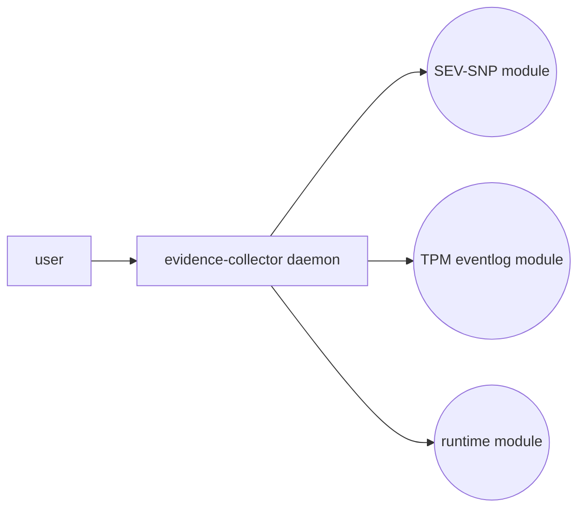

# Evidence Collector Tool Meeting Minutes

This group focuses on designing and building an evidence collector tool that can be deployed on multiple cloud environments. It aims to standardize the evidence format and modularize the tool so it can dynamically load modules necessary for a target environment.

## Contributors

 - Thomas Fossati <thomas.fossati@linaro.org>
 - Dionna Amalie Glaze <dionnaglaze@google.com>
 - Jagannathan Raman (Jag) <jag.raman@oracle.com>
 - Ian Chin Wang (Tom) <ian.chin.wang@oracle.com>

## Status bulletin

 - We will introduce "provisional" media types instead of waiting for the vendors.
 - We are working on the design specifications and expect to implement them once they are available

## Design summary

## Action Items
The following are the action items we discussed in the meetings. If any of them are inaccurate, please feel free to update them.
### Thomas
 - follow-up with Intel about media type
 - Specification for the user <-> tool interface

### Dionna
 - follow-up with AMD about media-type for SEV-SNP
 - Specification for the composition interface. The composition interface is between the tool and various modules. The tool figures out the evidence that the module wants to present (such as the SEV-SNP attestation report, TPM logs, and runtime measurement) and encodes it as a CMW.

### Jag

### Tom

 - Explore dependencies and language options

## August 15, 2024
### Dionna
 - I will continue my talks with distros on how they want to provide a good measured boot story. I've already shared a doc with Canonical and SUSE about this [https://docs.google.com/document/d/1CtTRqkF6M1XHl6_QknQJVzU3k7uBm0kUsve7tO5le-U/edit?tab=t.0#heading=h.wwvn00vu8yj5](https://docs.google.com/document/d/1CtTRqkF6M1XHl6_QknQJVzU3k7uBm0kUsve7tO5le-U/edit?tab=t.0#heading=h.wwvn00vu8yj5)
 - I will ask AMD to register a media type with the IANA for the ATTESTATION_REPORT.
 - I can ask Intel's TDX team (probably Jun Nakamura) to register a media type with the IANA for the TDQUOTE.
 - I will write up a draft for the evidence collection composition API once Thomas has the agent API draft ready. Likely REST function will be --function, GET parameters will be eponymous and if binary expected to be paths to files containing the binary contents, and POST parameters we can discuss if they're needed. I just want to avoid any parsing requirements outside of standard flag support libraries.
 - 
### Thomas

 - Thomas owns the agent API and will fill that out more for content negotiation.
 - Thomas will figure out the RISC-V story?
 - If the project is hosted under the Veraison umbrella/org, we'd package thos request up with the more general inquiry about rel-engineering & security escalation support from the CCC

### Tom & Jag

 - Explore dependencies, language options and release infrastructure service dependencies

## September 12, 2024
### Media-type registration

Content media type topic:
 - We will introduce "provisional" media types instead of waiting for the vendors. We will push vendors in the meantime
 -  Dionna to follow-up with AMD about media-type for SEV-SNP
 - Thomas to follow-up with Intel about media-type
 - We are going to seek Ned's help concerning TPM event logs media types as he has contacts in the TCG working group
 - configfs tsm: In addition to inblob & outblob, we need media types for auxblob and manifestblob.

Evidence collector tool topic:
 - EAT signature: where does the evidence collector derive its Root-Of-Trust?
 - EAT wraps CMW so evidence collector can sign it.
 - Allowance for unsigned EAT
